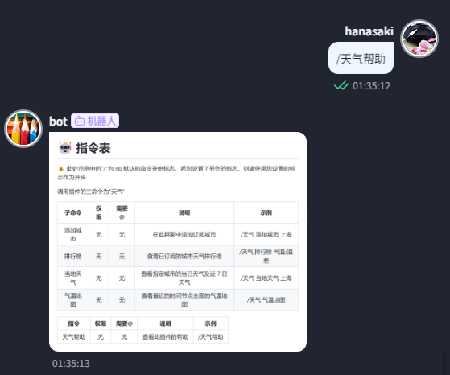

<div align="center">

<a href="https://v2.nonebot.dev/store">
    
</a>

# nonebot-plugin-weatherpk

[](./LICENSE)
[](https://pypi.python.org/pypi/nonebot-plugin-weather-rank)


</div>

## 📖 介绍

简单的天气排行榜

## 💿 安装

<details open>
<summary>使用 nb-cli 安装</summary>

在 nonebot2 项目的根目录下打开命令行, 输入以下指令即可安装

```sh
    nb plugin install nonebot-plugin-weather-rank
```

</details>

<details>
<summary>使用包管理器安装</summary>

在 nonebot2 项目的插件目录下, 打开命令行, 根据你使用的包管理器, 输入相应的安装命令

<details>
<summary>pip</summary>

```sh
  pip install nonebot-plugin-weather-rank
```

</details>

打开 nonebot2 项目根目录下的 `pyproject.toml` 文件, 在 `[tool.nonebot]` 部分追加写入

```python
    plugins = ["nonebot_plugin_weather_rank"]
```

</details>

## 💥 破坏性更新

- 若您正在使用 0.1.4 及以下版本，若需升级，则应当按照[nonebot-plugin-orm 文档](https://nonebot.dev/docs/best-practice/database/user)中的指南对数据进行删除

```bash
nb orm downgrade nonebot_plugin_wordcloud@base  # 降级数据库，删除数据
```

- 此插件从 0.1.5 版本开始使用 `tortoise-orm` 对数据库进行管理，移除对 `nonebot-plugin-orm` 的依赖。~~才不是因为 plugin-orm 的文档不全呢(x)~~

## 🎉 使用

### 💡 数据来源

[和风天气](https://dev.qweather.com)
[中国气象局](http://www.nmc.cn/publish/observations/hourly-temperature.html)

#### 插件配置

🔧 请在你的 bot 根目录下的`.env` `.env.*`中添加以下字段

|        字段        | 类型 | 默认值 |   可选值   |                               描述                               |
| :----------------: | :--: | :----: | :--------: | :--------------------------------------------------------------: |
|  QWEATHER_API_KEY  | str  |   无   |     无     |                         和风天气 api key                         |
| QWEATHER_RANK_MODE | int  |   0    |    0/1     | 调用和风天气 api 的模式，0 为免费订阅模式，1 为标准/高级订阅模式 |
|   SCHEDULE_HOUR    | int  |   8    |   0 - 23   |                          推送的时间(h)                           |
|  SCHEDULE_MINUTE   | int  |   0    |   0 - 23   |                         推送的时间(min)                          |
|  SCHEDULE_SWITCH   | bool |  True  | True/False |                           全局推送开关                           |

### ✨ 功能介绍

- [x] 添加订阅城市 <br>
      

- [x] 查看已订阅城市气温/温差排行榜<br>
      

- [x] 查看某地实时气温及预报<br>
      

- [x] 查看全国气温地图(可能会有 1h 延迟)<br>
      

- [x] 获取插件帮助信息<br>
      

- [x] 订阅每日推送

### 🚩 TODO

- [ ] 实现付费订阅 api 相应功能

### 🤖 指令表

⚠️ 此处示例中的"/"为 nb 默认的命令开始标志，若您设置了另外的标志，则请使用您设置的标志作为开头

调用插件的主命令为"天气"

|    子命令     | 权限 | 需要@ |                说明                 |           示例           |
| :-----------: | :--: | :---: | :---------------------------------: | :----------------------: |
| 添加/删除城市 |  无  |  无   |     在此群聊中添加/删除订阅城市     | /天气 添加/删除城市 上海 |
|    排行榜     |  无  |  无   |     查看已订阅的城市天气排行榜      |  /天气 排行榜 气温/温差  |
|   当地天气    |  无  |  无   | 查看指定城市的当日天气及近 7 日天气 |   /天气 当地天气 上海    |
|   气温地图    |  无  |  无   |  查看最近的时间节点全国的气温地图   |      /天气 气温地图      |
|     订阅      |  无  |  无   |           订阅排行榜推送            |        /天气 订阅        |
|   取消订阅    |  无  |  无   |         取消订阅排行榜推送          |      /天气 取消订阅      |

|   指令   | 权限 | 需要@ |       说明       |   示例    |
| :------: | :--: | :---: | :--------------: | :-------: |
| 天气帮助 |  无  |  无   | 查看此插件的帮助 | /天气帮助 |

## 💬 写在最后

- 对现有 ui 不满意或有所建议的话，欢迎提 issue 或 pr
- ~~这插件真的会有人用么~~
- ~~在最后求个 star~~
